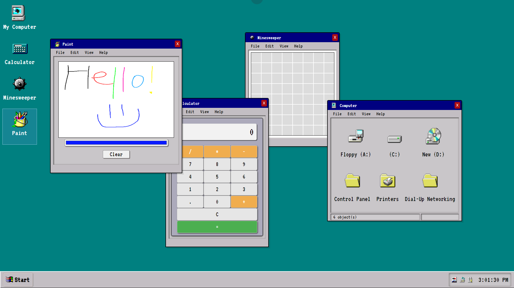

<h1 style="font-weight: 900"> FakeOS (AKA Windows 95 Clone) </h1>
(https://timbroderick44.github.io/fakeOS/)

I'm in my mid-30s so I grew up using Windows 95. This project was a great opportunity to go back and appreciate the archaic joy that Windows 95 brought while learning more about DOM traversal and manipulation.

<h1 style="font-weight: 900"> Screenshots </h1>

## 1. Plain Old Desktop

## 2. Check out that 'Start' bar! 

## 3. I Can Open More Than One!? And, The Windows Overlap!? 

## 4. That's a Massive Window

## What did I use to create it?

This project uses:
- HTML (minimal amounts)
- SCSS
- JS (99% - as focused a lot on DOM traversal and manipulation)

## Features of the Project:
- Start up screen to imitate the system starting up. 
- Interactive, functional - dynamically created - apps:
  - My Computer
  - Calculator 
  - Minesweeper 
  - Paint
- a dynamically-created 'Start' menu and submenus (better interactivity coming soon!!)
- Windows are draggable! 
- My Computer and the Paint app are able to be resized (bottom-right hand corner)
- The Paint app allows for drawings, brush width and brush color to be retained when dragging or resizing a window. (More functionality to come)
- Fun, hidden 'Easter Eggs' throughout ..... **Do not click on 'Self-destruct!!'**

The purpose of the project was to become comfortable with traversing the DOM and developing a stronger familiarity with JS. 

<h1 style="font-weight: 900"> Here are some of the lessons I learnt:</h1>

## Traversing the DOM and manipulation:

In the beginning, I wasn't very familiar with working with the DOM. For example, when I started, most of the elements were created in the HTML file (e.g. the icons on the desktop and the taskbar). By the end of the project, I was much more comfortable creating elements through JS on the fly. It's an incredible feeling seeing so little HTML in the DevTools but knowing that there's so much more functionality going on behind the scenes. One of the things I'd really like to do, is go back and refactor the functions that create the apps and windows. Right now, they serve their purpose but the amount of code could easily be reduced.

## Deeper Understanding of JS

I was familiar with JS but was I always a bit rigid and limited in being able to use it. Due to the scope of the project, there was a variety of unique situations in which I could practise developing these skills. I feel more confident but I'm sure there's more I can do to refactor the code and improve on the efficiency of it. As I learn more, I'll be sure to update this project. 

## Using Media & Creating 'Apps' 

Using media in JS was simple but it was a lot fun and instantly added a more engaging, interactive feel to the project. In addition, being able to have apps within - essentially - an operating system, was incredible. Starting with a blank, white page in a browser and finishing with an interactive, functional operating system (or the facade of one) was a really educational and rewarding experience.

## What I want to include in the future:

## Have more functionality (with menus, icons, apps, etc):
- [ ] Be able to download drawings made in the Paint app.
- [ ] Allow users to create, modify, and delete files.
- [ ] Have a context menu (e.g., when you right-click on the desktop).
- [ ] Have working mock directories for users to traverse.
- [ ] Have a real Minesweeper app (right now, it's more like Russian Roulette).

## More efficient and standard code:
- [ ] As this was a learning process, there's a lot I can go back and change. 
- [ ] I want to look into creating a universal app creator (i.e., a function that creates all app windows and 'attaches' the contents to it. Right now, it exists but just for the desktop apps).
- [ ] Learn more about `target.dataset` for accessing custom data attributes and learning more about best practices for managing states.
- [ ] Learn more about fragments (i.e., not attaching elements to the DOM one-by-one but waiting until they have all been appended... I think).

## More fun Easter Eggs:
- [x] Don't want to spoil it but utilize 'run' and 'MS-DOS' more to create fun, interactive surprises.

## Thank You!

Thank you for taking the time to look at this project. I really hope you enjoy it. 
Feel free to reach out and ask any questions.

[Tim Broderick]

[Tim Broderick]
